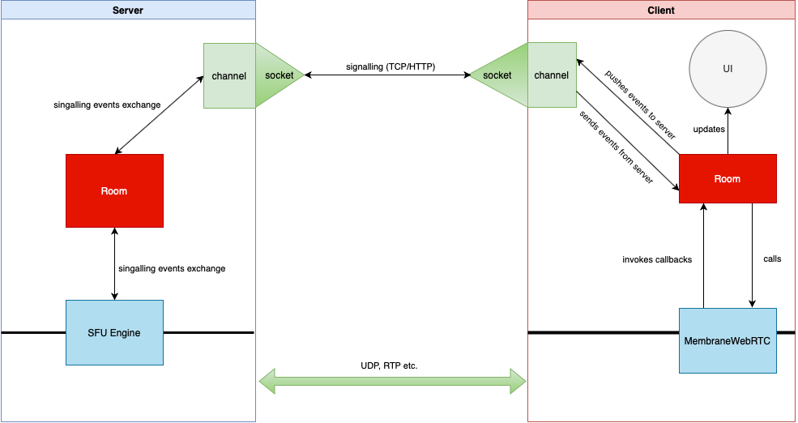
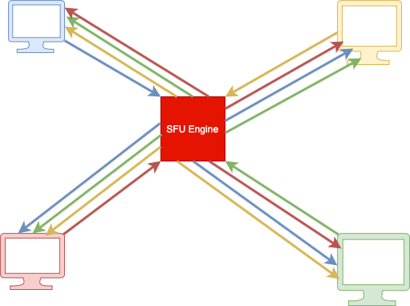

# Planning is always a good idea
  Hang on for a moment! I know that after slipping through the tons of the documentation you are really eager to start coding, but let's think for a moment before taking any actions. How do we want our application to look like?
  Can we somehow decompose our application?

  Sure we can - as in each web application we have two independent subsystems:
  + server (backend) - written in Elixir, one and the only for the whole system. It will spawn a `Room` process for each of the rooms created by the users, which will handle 
    signaling and relay media among the peers in the room.
  + client application (frontend) - the one written in form of JS code and executed on each client's machine (to be precise - by client's web browser). It will be responsible for fetching user's media stream as well as displaying the stream from the peers.

  ## We might need something else than the plain Elixir standard library...
  Ugh...I am sure till now on you have already found out that media streaming is not that easy. It covers many topic which originates to the nature of the reality. 
  We need to deal with some limitations brought to us by the physics of the surrounding universe, we want to compress the data being sent with the great tools 
  mathematics has equipped us with, we are taking an advantage of imperfections of our perception system...
  All this stuff is both complex and complicated - and that is why we don't want to design it from very scratch. Fortunately, we have access to the protocols
  and codecs - ICE, RTP, H264, VP9, VP8, Opus etc. - which already solves the aforementioned problems. But that's not enough - 
  those protocols are also complicated and implementing or even using them requires digging into their fundamentals. 
  That is why we will be using the framework that provides some level of abstraction on top of these protocols. Ladies and gents - let me introduce to you - the Membrane framework.
  ## What does Membrane framework do?
  Seek at the root! [Membrane documentation](https://membraneframework.org/guide/v0.7/introduction.html)
  ## Membrane framework structure
  It would be good for you to know that the Membrane Framework consists of the following parts:
  + Core
  + Plugins
  
  We will be using one of its plugins - [RTC Engine plugin](https://github.com/membraneframework/membrane_rtc_engine), which has both the server part (written in Elixir) 
  and the client's library (written in Javascript). This plugin provides both the implementation of the 
  [Selective Forwarding Unit (SFU)](https://github.com/membraneframework/membrane_rtc_engine) and the signaling server logic (with the usage of ICE protocol).

  ## System scheme
  The diagram below describes the desired architecture of the events passing system which is the part of the system we need to provide on our own:  
  

  And here is how the **SFU Engine** will relay multimedia streams: 
   
  
  In terms of media streaming, our server will be a Selective Forwarding Unit (SFU).
  Why do we want our server to be a Selective Forwarding Unit? The reason is that such a model of streaming data 
  among peers allows us to balance between server's and client's bandwidth and limit CPU usage of the server. 
  SFU is receiving stream from each of the peers and passes each of these streams to each of the other peers.  

  ## Server
  As pointed previously, the server will have two responsibilities - the first one is that it will work as a signalling server, broadcasting event messages among the peers.
  The second one is that it will act as a streaming server. 
  The Membrane Framework provides Selective Forwarding Unit implementation called `SFU Engine`, which handles both the signaling and streaming. 
  In the tutorial we will wrap the `SFU Engine` and provide business logic in order to add video room functionalities.

  The server will consist of two components holding the logic and two components needed for communication.
  The communication will be done with the use of Phoenix sockets and that is why we will need to define the `socket` itself and a `channel` for each of the rooms.
  
  The "heart" of the server will be `SFU Engine` - it will deal with all the dirty stuff connected with both the signaling and streaming. We will also have a separate `Room` process (one per each of the video rooms) whose responsibility will be to aggregate information about peers in the particular room.
  `SFU Engine` will send event messages (e.g. `:new_peer` or `:sfu_media_event` messages) on which obtainment the `Room` process will react, for instance, by dispatching them to the appropriate peer's `channel`. `Channel` will then send those messages to the client via the `socket`.
  Messages coming on the `socket` will be dispatched to the appropriate `channel`. Then the `channel` will send them to the `Room`'s process, which finally will pass them to the `SFU Engine`.
  Media transmission will be done with the use of streaming protocols. The way in which this will be performed is out the scope of this tutorial. The only thing you need to know is that SFU Engine will also take care of it. 

  ## Client 
  Each client's application will have a structure reassembling the structure of the server.
  
  In the `Room` instance, the client will receive messages sent from the server on the associated `channel`. The `Room` will call the appropriate methods of `MembraneWebRTC` object.
  At the same time, `MembraneWebRTC` object will be able to change the `Room`'s state by invoking the callbacks provided during construction of this object. These callbacks as well as the `Room` object itself will be able to update the user's interface. 
  
  Be aware that `MembraneWebRTC` object will also take care of the incoming media stream.